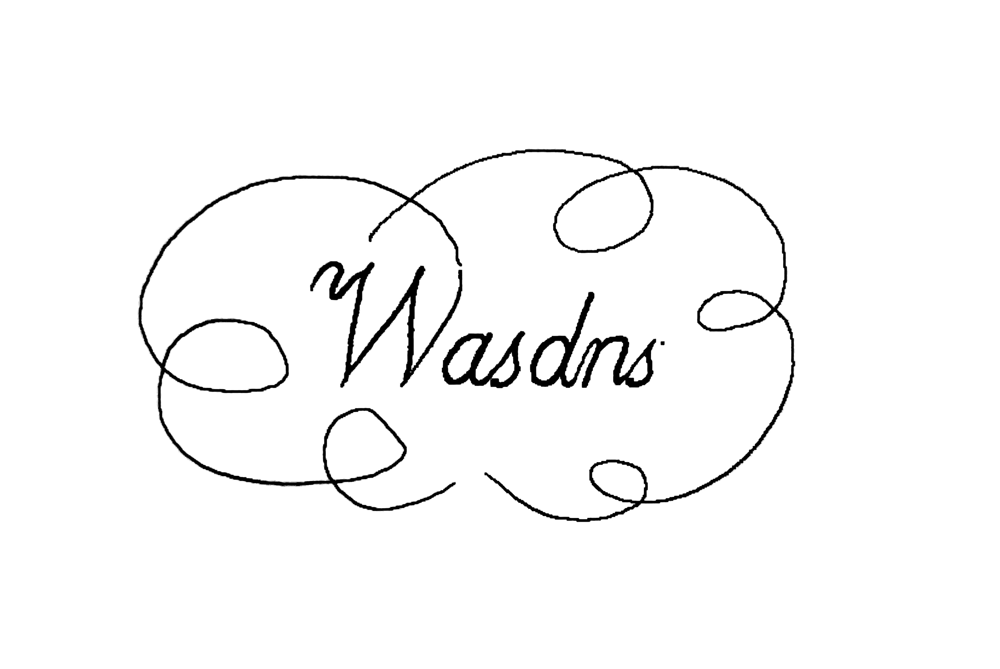

## About me

I am a first-year master student of ICT, CAS, and [College of Mathematics and Computer Science](http://cmcs.fzu.edu.cn/website/f/homepage) at [Fuzhou University](http://www.fzu.edu.cn/). 
My advisors are [Qun Huang](http://huangqundl.github.io/), and Dong Zhang.
My research interests including software-defined networking (SDN), network function virtualization (NFV), network virtualization (NV), programmable/stateful data plane (major in P4), network security, network measurement, and so on.

## Recent News

### 2019

- October 8, 2019. A paper titled "Design and Implementation of In-Network Gradient Compression for Accelerating Distributed Training of Deep Neural Networks" was accepted by [The Second National Conference on Advanced Computing and Defense](http://cacd.xintongconference.com/zh-CN/web/page?mid=264&pid=Home). (Co-author)
- Since 2019.02, I joined ACS INNOV lab in ICT, CAS.

### 2018

- December 9-13, 2018. I participated the [GLOBECOM 2018](http://globecom2018.ieee-globecom.org/) and presented our paper in Abu Dhabi. 
- Octorber - December, 2018. I visit the NGNT laboratory, Zhejiang University. 
- November 17, 2018. A paper titled "P4SC: Towards High-Performance Service Function Chain Implementation on the P4-Capable Device" was accepted by [IM 2019](http://im2019.ieee-im.org) (CCF C). (First-author)
- November 6, 2018. I participated [The First National Conference on Advanced Computing and Defense](http://cacd.xintongconference.com/zh-CN/web/page?mid=264&pid=Home) and presented our paper at Zhejiang Lab.
- October 19, 2018. A paper titled "PSG: Towards Attack-Free P4 Stateful Data Plane" was accepted by [The First National Conference on Advanced Computing and Defense](http://cacd.xintongconference.com/zh-CN/web/page?mid=264&pid=Home). (First-author)
- October 11-13, 2018. I attended [The 11th National Conference of Undergraduate on Innovation and Entrepreneurship](http://gjcxcy.bjtu.edu.cn/Index.aspx). [News](http://news.fzu.edu.cn/html/fdyw/2018/10/16/677c41ee-b257-4131-a49b-56815515fb2f.html).
- July 15, 2018. A paper titled "MATReduce: Towards High-Performance P4 Pipeline by Reducing Duplicate Match Operations" was accepted by [GLOBECOM 2018](http://globecom2018.ieee-globecom.org/) (CCF C). (First-author)

